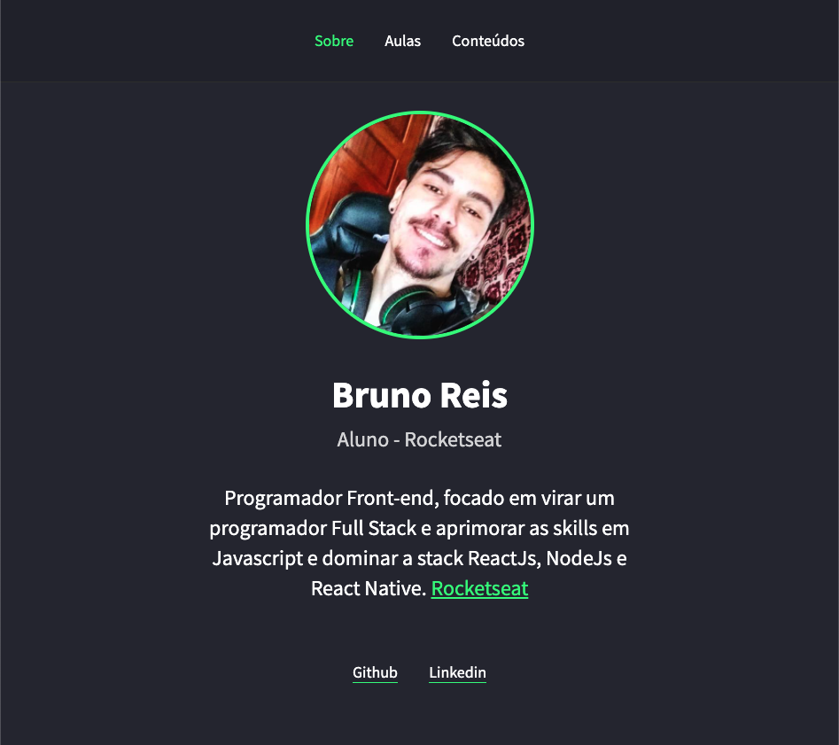

# Rocketseat Portfoil Project

## Projeto feito em aula (Página de posts foi dado como exercício para finalização do projeto). Portdólio com vídeos e posts da Rocketseat.

### Technologys:
  

### Features:
- [x] Lista de vídeos e posts dinâmicos;
- [x] Abrir, fechar, maximizar e minimizar modal com os conteúdos;

### Status: 
#### Finalizado! :rocket:

### Author:
<a href="https://www.linkedin.com/in/bruno-reis-9a937b189/">
 
  
 <b>Bruno Reis :rocket:</b>
</a>

##### Contact:

